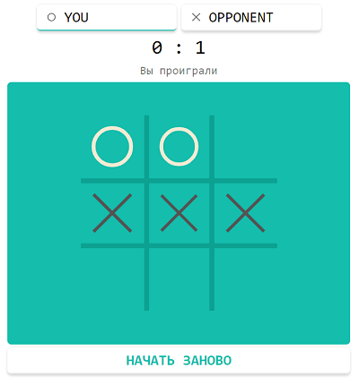

# Крестики-нолики

### Запуск

1. Клонировать репозиторий
    ```bash
    git clone https://github.com/UserNikita/tic_tac_toe_online.git
    ```
2. В папке проекта запустить докер контейнер
    ```bash
    docker-compose up -d
    ```
3. Открыть в двух вкладках или двух браузерах страницу с адресом *http://127.0.0.1:8080*

### Скриншот
